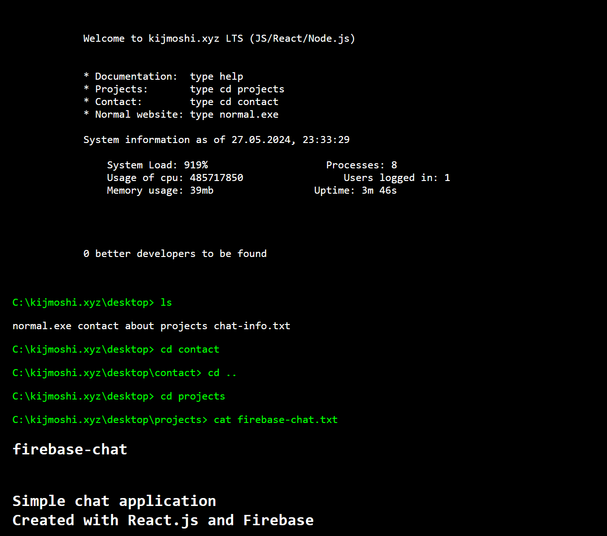

# portfolio
This is a portfolio of my work. It's styled as ubuntu terminal, its build with small express server to handle logged in user count(and chat in future) and vanilla js. It's hosted on render.com.

This site is still under construction. Please check back soon for updates.

# normal version
if you want to see the normal version of the site, please visit [kijmoshi.xyz](https://kijmoshi.xyz)

## to do
- [ ] Add more projects
- [ ] Add more details to existing projects
- [ ] Add a blog
- [ ] Add a chat

## host
This site is hosted on render.com at [cli.kijmoshi.xyz](https://cli.kijmoshi.xyz)